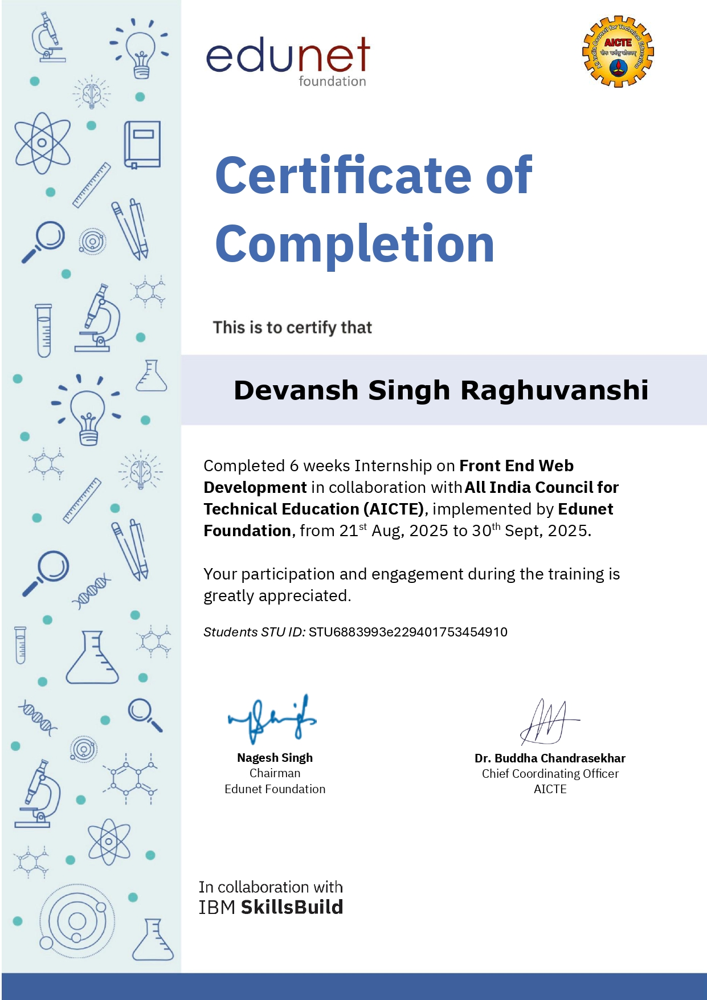

# ✨ Zenith Study Planner

A modern, all‑in‑one **Study Planner and Productivity Web App** built with **React + TypeScript + Vite**.  
Zenith helps students organize tasks, track projects, and stay motivated through gamification and focus tools — all in a sleek, offline‑capable interface.

---

## 📚 **Table of Contents**
- [🌟 Project Overview](#-project-overview)
- [🚀 Features](#-features)
- [🧠 Tech Stack](#-tech-stack)
- [🏗️ Project Structure](#-project-structure)
- [⚙️ Installation & Setup](#️-installation--setup)
- [📸 Screenshots](#-screenshots)
- [📅 Calendar Enhancements](#-calendar-enhancements)
- [📈 Results / Outcomes](#-results--outcomes)
- [🧭 Future Scope](#-future-scope)
- [🎓 Internship & Certificates](#-internship--certificates)
- [🌐 Important Links](#-important-links)
- [🤝 Contribution](#-contribution)
- [💬 Authors & Credits](#-authors--credits)
- [📜 License](#-license)

---

## 🌟 Project Overview
**Zenith Study Planner** is a client‑side web application that empowers students to organize their study schedules, track academic tasks, visualize project timelines, and stay motivated with gamification and focus mode features.

**Key Objectives:**
- Simplify academic planning through centralized task management.  
- Encourage consistency via gamified rewards & study streaks.  
- Enhance focus through Pomodoro and ambient sound modes.  
- Provide an interactive, theme‑rich, and offline‑capable experience.  

> **Live Demo:** [https://zenith-study-planner.vercel.app](https://zenith-study-planner.vercel.app)  *(Replace with your deployed link)*

---

## 🚀 Features

### 🧩 Core Functionality
- 🗂 **Task Management (CRUD)** — create, update, complete, and delete study tasks.
- 📅 **Interactive Calendar** — visualize tasks, add personal notes/tips/events by date.
- 📊 **Progress Tracking** — real‑time stats via charts and progress summaries.
- 🕒 **Pomodoro Timer** — built‑in focus timer to improve concentration.
- 💾 **Offline‑Friendly** — data persists locally with `LocalForage` (IndexedDB).

### ✨ Unique Features
- 🎮 **Gamification System**
  - Earn points and badges for completing tasks.
  - Track study streaks over time.
- 🎧 **Focus Mode**
  - Distraction‑free UI, optional ambient sounds (Rain / Café).
  - Blurred background, minimal interface for deep work.
- 📈 **Project Gantt Chart**
  - Manage long‑term projects and visualize timelines.
  - Add summaries, tools used, time spent, detailed descriptions.
  - AI‑inspired animated gradient background for aesthetic design.
- 🌗 **Dynamic Theming**
  - Light/Dark mode with instant toggle.
  - Personalized UI themes.
- 🔔 **Notifications**
  - Toasts for success/error actions using `react-hot-toast`.

---

## 🧠 Tech Stack

| Layer | Tools & Libraries |
|:------|:------------------|
| **Frontend Framework** | React + TypeScript |
| **Build Tool** | Vite |
| **Styling** | Tailwind CSS, Framer Motion (animations) |
| **State Management** | Zustand |
| **Storage** | LocalForage (IndexedDB wrapper) |
| **Charts & Visualization** | Recharts |
| **Calendar** | React Big Calendar + date‑fns |
| **UI Components** | Lucide Icons, Custom Modal |
| **Notifications** | React Hot Toast |
| **Version Control** | Git + GitHub |
| **Deployments** | Netlify / Vercel (static hosting) |

---

## 🏗️ Project Structure

```

zenith-study-planner/
├── public/
│ └── sounds/
│ ├── rain.mp3
│ └── cafe.mp3
│
├── src/
│ ├── assets/ # optional static assets
│ ├── components/
│ │ ├── common/ # Reusable UI (Modal)
│ │ ├── dashboard/ # Dashboard widgets
│ │ ├── features/ # Pomodoro, Focus Mode, Theme, Gantt Chart, Audio
│ │ ├── layout/ # Layout shell, header, sidebar
│ │ └── tasks/ # Task-related components (List, Item, Form)
│ │
│ ├── context/ # ThemeContext (dark/light)
│ ├── lib/ # Helpers (localizer for calendar)
│ ├── pages/ # Main routes (Dashboard, Tasks, Calendar, Projects, Settings)
│ ├── store/ # Zustand stores: taskStore, uiStore, gamificationStore, projectStore
│ ├── styles/ # Custom CSS (calendar overrides)
│ ├── types/ # TypeScript type definitions
│ ├── App.tsx # Routes configuration
│ ├── main.tsx # App bootstrap
│ ├── index.css # Global styles / Tailwind integration
│ └── ...
│
├── .gitignore
├── index.html
├── package.json
├── tailwind.config.js
├── tsconfig.json
├── vite.config.ts
└── README.md # (this file)

````


---

## ⚙️ Installation & Setup

**Prerequisites:**
- Node.js ≥ 18
- npm ≥ 9

### 1. Clone the repository
```bash
git clone https://github.com/yourusername/zenith-study-planner.git
cd zenith-study-planner
````

### 2. Install dependencies
```Bash
npm install
````

### 3. Run the development server
```Bash
npm run dev
````
The app will start on http://localhost:5173

### 4. Build for production
```Bash
npm run build
````

### 5. Preview build
```Bash
npm run preview
````

---

## 📸 Screenshots

---

**Dashboard**


---

**Tasks**	


---


---


---

**Calendar**


---


---


---


---

**Focus Mode**


---

**Projects**


---

**Settings**


---

## 🧩 Key Components Overview
* **TaskForm →** modal form to create/edit tasks
* **TaskList / TaskItem →** displays and organizes tasks
* **GanttChart →** timeline visualization for projects
* **FocusModeToggle →** triggers distraction‑free study mode
* **PomodoroTimer →** study‑interval timer
* **GamificationStats →** streak counter & points

---

## 📅 Calendar Enhancements
* Add notes, events, and study tips directly on calendar cells.
* Switch between Month / Week / Day / Agenda views.
* Tasks auto‑populate from Task Manager store.
* Color‑coded events for easy recognition.

---

## 📈 Results / Outcomes
* Seamless study management and motivation in one SPA.
* Engaging and intuitive interface for daily use.
* Offline‑friendly productivity tracker built only with frontend tech.

---

## 🧭 Future Scope
* 🔑 User authentication & cloud sync.
* 🧠 AI assistant for study planning.
* 👫 Collaborative group projects.
* 📱 PWA mobile support.
* 📄 Export reports / achievements to PDF.

---

## 🎓 Internship & Certificates

* **Internship:** Web Development Internship @ Edunet Foundation
* **Duration:** August 2025 – September 2025
* **Role:** Frontend Developer / Intern
* **Supervisor:** Channabasava Yadav

<p align="center">
  
</p>

📜 [View Verified Certificate](https://drive.google.com/file/d/1P2Zqwe27IBv-BirU6eiKKQG4o56g4S8G/view?usp=sharing)

---

## 🌐 Important Links

| Purpose              | URL |
|---------------------|-----|
| **Live Demo**       | [zenith-study-planner.vercel.app](https://zenith-study-pla-git-2105d3-devansh-singh-raghuvanshis-projects.vercel.app/) |
| **GitHub Repository** | [zenith-study-planner](https://github.com/DSR001915/zenith-study-planner.git) |
| **LinkedIn Profile** | [devansh-singh-raghuvanshi](https://www.linkedin.com/in/devansh-singh-raghuvanshi-30b578231/) |

---

## 🤝 Contribution
  
Contributions are welcome!

1. Fork the repository
2. Create your feature branch (git checkout -b feature/amazing-feature)
3. Commit changes (git commit -m 'Add new feature')
4. Push to the branch (git push origin feature/amazing-feature)
5. Open a Pull Request

---

## 💬 Authors & Credits
Developed by Devansh Singh Raghuvanshi
Technology stack guidance & structure inspired by modern React ecosystem.

---

## 📜 License
This project is open‑source under the MIT License — you can freely modify and distribute.

“Plan smart, stay consistent — reach your Zenith.” 🚀
